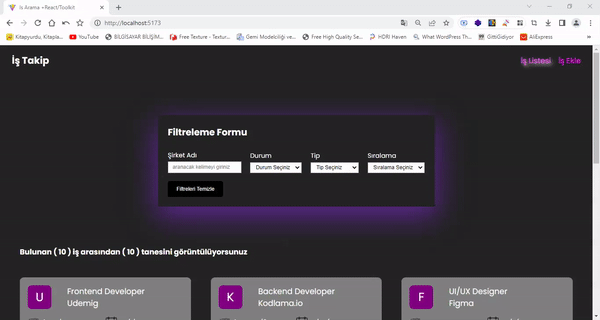

<h1># İş Takip Uygulaması</h1> 

<h3>Bu proje, iş başvurularını takip etmek için kullanılan bir iş takip uygulamasıdır. Kullanıcılar yeni işler ekleyebilir, mevcut işleri listeleyebilir ve işleri filtreleyebilirler.</h3> 

<h2>## Özellikler</h2> 

- Yeni iş ekleme: Kullanıcılar pozisyon, şirket, lokasyon, durum, tür ve tarih bilgilerini girerek yeni bir iş ekleyebilirler. 
- İşleri listeleme: Kullanıcılar eklenen işleri listeleyebilirler. Listelenen işler, şirket adı, pozisyon, lokasyon, tür ve durum bilgilerini içerir. 
- İşleri filtreleme: Kullanıcılar işleri durum ve tür gibi özelliklere göre filtreleyebilirler. 
- Arama yapma: Kullanıcılar şirket adına göre işleri arayabilirler. 
- Sıralama: Kullanıcılar işleri şirket adına göre A'dan Z'ye veya Z'den A'ya sıralayabilirler. 
- Filtreleri temizleme: Kullanıcılar tüm filtreleri temizleyerek orijinal iş listesine dönebilirler. 

<h2>## Veri Saklama</h2>

Bu uygulama, verileri `db.json` dosyasında saklamaktadır. İşlerin eklenmesi ve listelenmesi bu dosya üzerinden gerçekleşir. İşlem yapılırken, Axios kütüphanesi kullanılarak HTTP istekleri gönderilir ve bu dosya üzerinde işlemler yapılır. 

Yeni bir iş eklenmek istendiğinde, kullanıcı tarafından girilen veriler `POST` isteği ile `db.json` dosyasına gönderilir ve dosyaya kaydedilir. İşler listelendiğinde ise `GET` isteği ile `db.json` dosyasından veriler çekilir ve kullanıcıya gösterilir. 

<h2>## Kullanılan Teknolojiler</h2> 

- React: Kullanıcı arayüzü oluşturmak için kullanılan JavaScript kütüphanesi. 
- Redux: Uygulama durumunu yönetmek için kullanılan durum yönetim kütüphanesi. 
- React Router: Sayfalar arası gezinme için kullanılan React kütüphanesi. 
- Axios: HTTP istekleri göndermek için kullanılan bir kütüphane. 
- react-toastify: Bildirim mesajlarını görüntülemek için kullanılan bir React bileşeni. 
- SCSS: Stil sayfalarını oluşturmak için kullanılan CSS önprosesörü. 

<h2><a href="https://is-takip-toolkit.netlify.app">## Canlı Önizleme</a></h2>

